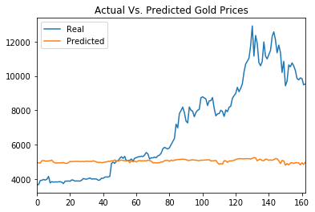
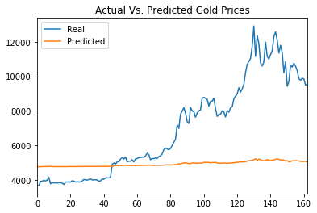

## Description

Predicted future Bitcoin prices by using closing prices and the Crypto Fear and Greed Index (FNG), which is an index based on sentiment from social media and news articles. To do so, I used the LSTM method of using trained data to predict the Bitcoin prices. 

## Project Breakdown

Separated the data by using 70% for training and 30% for testing, and applied MinMaxScaler to scale the data. 

### LSTM Model

Designed the LSTM model that takes the training data to fit it into the model. Trained the model by using 10 epochs on both FNG and closing prices data. Used model testing data to predict future Bitcoin prices to compare against the actual closing prices.

- FNG Actual vs. Predicted

- Closing Price Actual vs. Predicted

In conclusion, neither model reflected a high accuracy for predicting closing prices for this particular data, although changes to the model can be made to improve its prediction capabilities. 

### Technologies Used

- Python
- TensorFlow
- Deep Learning
- LSTM
